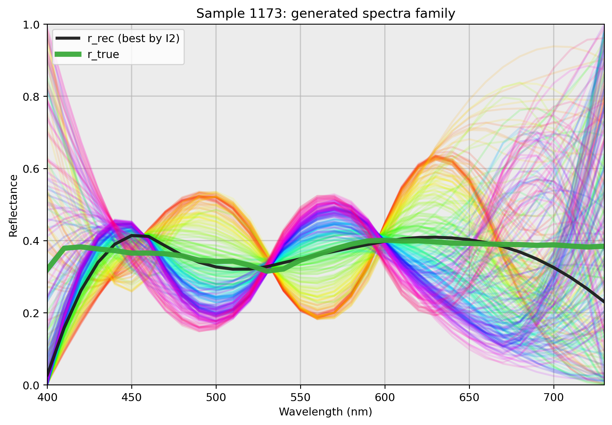
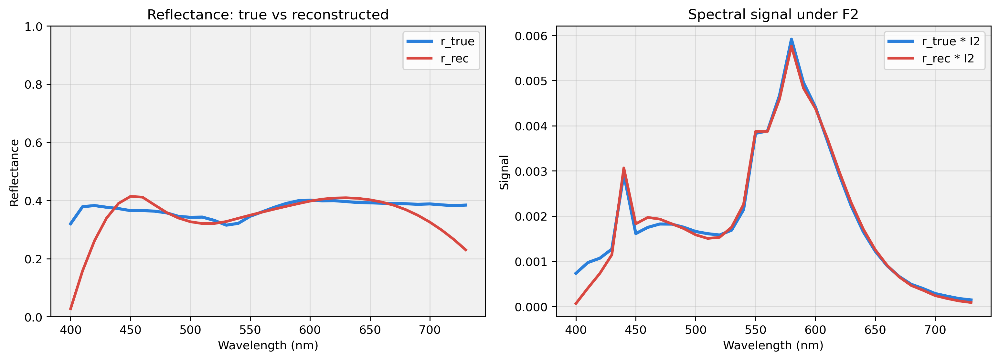
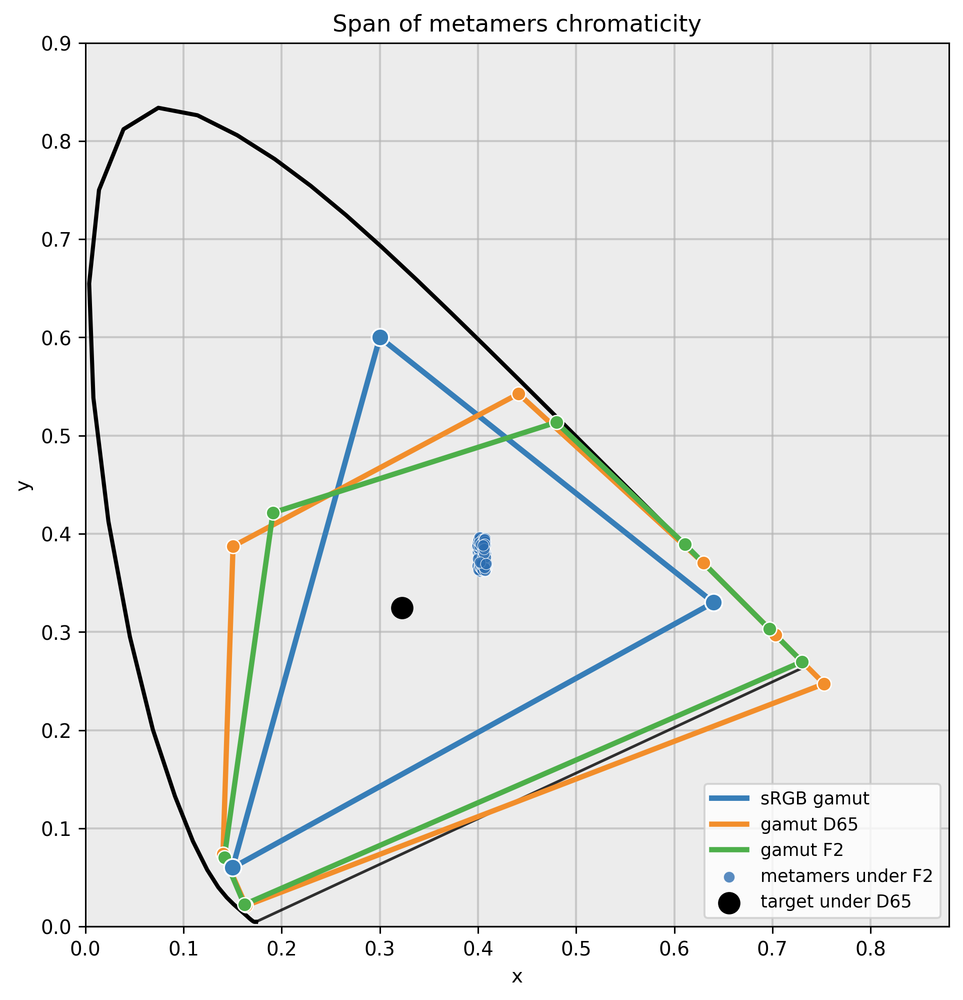
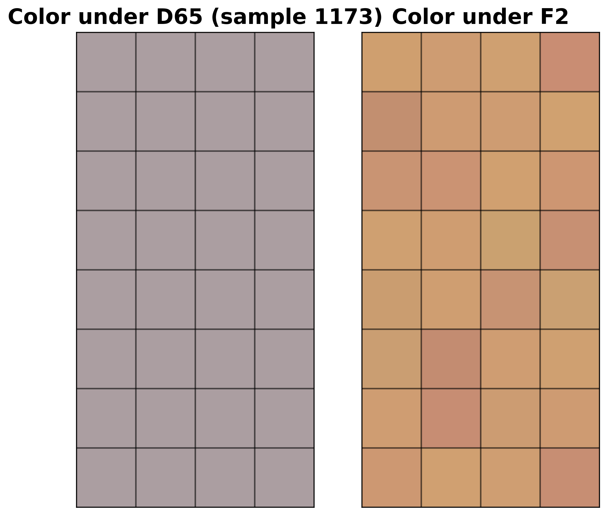

# Metamer Run Report

## Configuration
- **Illuminants**: `D65/F2`
- **n_neutral_candidates**: `220`
- **af_samples_per_tri_sample**: `1800`
- **seed_sample_search**: `2028`
- **min_meta_required**: `24`
- **top_cache_size**: `100`
- **n_samples_af**: `1000`
- **recon_seed**: `42`
- **lambda_smooth**: `0.03`
- **lambda_tail**: `0.12`

## Reconstruction Summary
- **Selected sample**: `1173`
- **Used cached class**: `True`
- **Candidates**: `275`
- **RMSE spectrum**: `0.07822948`
- **MAE spectrum**: `0.04310115`
- **err1_xyz_l2**: `7.85046229e-17`
- **err2_xyz_l2**: `4.28019687e-03`
- **err1_xy_l2**: `5.55111512e-17`
- **err2_xy_l2**: `2.63037856e-03`

## Cached Ranking (up to top_cache_size=100)
Shown rows: `100`.

### Main Columns
| sample | status | n_meta | score | xy_spread_max | xy_hull_area | dist_to_white_i1 |
| --- | --- | --- | --- | --- | --- | --- |
| 1170 | ok | 3409 | 0.318411 | 0.09289 | 0.001856 | 0.015925 |
| 1036 | ok | 3971 | 0.315865 | 0.092998 | 0.001835 | 0.021183 |
| 1238 | ok | 3494 | 0.303325 | 0.085957 | 0.001792 | 0.016774 |
| 729 | ok | 3241 | 0.282336 | 0.087851 | 0.001599 | 0.02024 |
| 1100 | ok | 3162 | 0.275101 | 0.076802 | 0.00163 | 0.014908 |
| 372 | ok | 5587 | 0.272673 | 0.081224 | 0.001578 | 0.01992 |
| 564 | ok | 3089 | 0.267256 | 0.085515 | 0.001495 | 0.011787 |
| 621 | ok | 2983 | 0.266918 | 0.08211 | 0.00152 | 0.013136 |
| 504 | ok | 3258 | 0.2666 | 0.080011 | 0.001536 | 0.010987 |
| 441 | ok | 5906 | 0.265978 | 0.083844 | 0.001502 | 0.018365 |
| 1169 | ok | 3068 | 0.262948 | 0.072013 | 0.001569 | 0.013101 |
| 36 | ok | 2655 | 0.262913 | 0.072351 | 0.001569 | 0.020236 |
| 677 | ok | 3257 | 0.261273 | 0.081985 | 0.001473 | 0.020987 |
| 622 | ok | 3322 | 0.259316 | 0.082914 | 0.00145 | 0.015769 |
| 676 | ok | 2928 | 0.259206 | 0.078609 | 0.001484 | 0.020303 |
| 563 | ok | 2823 | 0.256295 | 0.077373 | 0.001471 | 0.012095 |
| 1237 | ok | 2940 | 0.254585 | 0.0695 | 0.001523 | 0.015205 |
| 572 | ok | 3231 | 0.244039 | 0.080479 | 0.001344 | 0.021353 |
| 503 | ok | 2815 | 0.243498 | 0.073796 | 0.001396 | 0.013841 |
| 1034 | ok | 2564 | 0.194375 | 0.059438 | 0.001105 | 0.01798 |
| 779 | ok | 2055 | 0.189743 | 0.059156 | 0.001069 | 0.016897 |
| 1168 | ok | 2154 | 0.188884 | 0.058071 | 0.001069 | 0.01218 |
| 1099 | ok | 2403 | 0.185912 | 0.057336 | 0.001052 | 0.013499 |
| 835 | ok | 1969 | 0.185335 | 0.058166 | 0.001041 | 0.018528 |
| 675 | ok | 2120 | 0.184892 | 0.057682 | 0.001042 | 0.016956 |
| 727 | ok | 2063 | 0.183253 | 0.05704 | 0.001033 | 0.019865 |
| 620 | ok | 2124 | 0.182495 | 0.057108 | 0.001028 | 0.013564 |
| 969 | ok | 2568 | 0.181802 | 0.05671 | 0.001025 | 0.018402 |
| 1236 | ok | 2159 | 0.180398 | 0.055866 | 0.001018 | 0.013194 |
| 502 | ok | 2099 | 0.178073 | 0.053952 | 0.001018 | 0.014402 |
| 562 | ok | 2023 | 0.173896 | 0.05378 | 0.000984 | 0.011963 |
| 35 | ok | 2008 | 0.167671 | 0.050732 | 0.000958 | 0.017163 |
| 439 | ok | 3767 | 0.164319 | 0.050165 | 0.000937 | 0.021267 |
| 106 | ok | 1762 | 0.160252 | 0.048364 | 0.000916 | 0.020524 |
| 1033 | ok | 1332 | 0.134493 | 0.048638 | 0.000699 | 0.014029 |
| 778 | ok | 1263 | 0.13359 | 0.047334 | 0.000702 | 0.018538 |
| 1098 | ok | 1296 | 0.133216 | 0.04743 | 0.000697 | 0.010162 |
| 896 | ok | 1568 | 0.132591 | 0.04866 | 0.000684 | 0.016243 |
| 726 | ok | 1285 | 0.13224 | 0.047771 | 0.000688 | 0.016161 |
| 34 | ok | 1104 | 0.130761 | 0.04608 | 0.000689 | 0.013745 |
| 674 | ok | 1411 | 0.129377 | 0.045881 | 0.00068 | 0.012003 |
| 619 | ok | 1470 | 0.1285 | 0.047098 | 0.000663 | 0.011706 |
| 1136 | ok | 876 | 0.128107 | 0.04677 | 0.000661 | 0.014416 |
| 1069 | ok | 955 | 0.126147 | 0.045419 | 0.000656 | 0.019976 |
| 834 | ok | 1193 | 0.125959 | 0.04599 | 0.00065 | 0.016872 |
| 968 | ok | 1299 | 0.125842 | 0.045678 | 0.000652 | 0.01434 |
| 561 | ok | 1512 | 0.125735 | 0.045948 | 0.00065 | 0.011628 |
| 438 | ok | 2804 | 0.125253 | 0.044507 | 0.000659 | 0.019415 |
| 594 | ok | 1584 | 0.125234 | 0.045168 | 0.000652 | 0.020812 |
| 172 | ok | 1159 | 0.124504 | 0.044163 | 0.000652 | 0.019327 |
| 1235 | ok | 1003 | 0.1242 | 0.045639 | 0.000638 | 0.010248 |
| 1205 | ok | 827 | 0.123497 | 0.042603 | 0.00066 | 0.019462 |
| 1106 | ok | 712 | 0.12344 | 0.045933 | 0.000629 | 0.019276 |
| 1243 | ok | 817 | 0.123154 | 0.04303 | 0.000653 | 0.019436 |
| 105 | ok | 980 | 0.122764 | 0.044207 | 0.000638 | 0.015574 |
| 1167 | ok | 1031 | 0.122411 | 0.044476 | 0.000633 | 0.008848 |
| 501 | ok | 1655 | 0.11972 | 0.042648 | 0.000628 | 0.015765 |
| 1175 | ok | 801 | 0.118563 | 0.043515 | 0.000612 | 0.01674 |
| 1068 | ok | 492 | 0.094524 | 0.040977 | 0.000431 | 0.017123 |
| 33 | ok | 545 | 0.093673 | 0.039448 | 0.000438 | 0.011684 |
| 967 | ok | 667 | 0.092911 | 0.041598 | 0.000412 | 0.014361 |
| 1032 | ok | 702 | 0.09266 | 0.040989 | 0.000415 | 0.011998 |
| 895 | ok | 810 | 0.09262 | 0.041504 | 0.000412 | 0.015394 |
| 777 | ok | 714 | 0.092254 | 0.039602 | 0.000423 | 0.0192 |
| 1097 | ok | 622 | 0.092222 | 0.040764 | 0.000414 | 0.008423 |
| 437 | ok | 1263 | 0.091826 | 0.038463 | 0.000432 | 0.019064 |
| 1234 | ok | 488 | 0.091808 | 0.040178 | 0.000415 | 0.008322 |
| 500 | ok | 839 | 0.091771 | 0.038265 | 0.000433 | 0.015328 |
| 833 | ok | 982 | 0.091572 | 0.040482 | 0.000413 | 0.013817 |
| 560 | ok | 805 | 0.091034 | 0.039634 | 0.000414 | 0.010109 |
| 231 | ok | 644 | 0.090439 | 0.038118 | 0.000422 | 0.021775 |
| 626 | ok | 865 | 0.090383 | 0.038174 | 0.000421 | 0.020707 |
| 593 | ok | 854 | 0.089915 | 0.037823 | 0.000421 | 0.021193 |
| 1166 | ok | 569 | 0.089753 | 0.038774 | 0.00041 | 0.007513 |
| 649 | ok | 862 | 0.089552 | 0.037457 | 0.00042 | 0.021101 |
| 1105 | ok | 426 | 0.089003 | 0.038275 | 0.000407 | 0.015165 |
| 1040 | ok | 523 | 0.088937 | 0.040112 | 0.000392 | 0.021113 |
| 673 | ok | 704 | 0.08878 | 0.038521 | 0.000404 | 0.0121 |
| 618 | ok | 791 | 0.0887 | 0.038417 | 0.000405 | 0.011035 |
| 104 | ok | 519 | 0.088679 | 0.038855 | 0.000401 | 0.013779 |
| 725 | ok | 780 | 0.08839 | 0.038175 | 0.000403 | 0.014735 |
| 1242 | ok | 354 | 0.088208 | 0.038255 | 0.000404 | 0.01869 |
| 171 | ok | 535 | 0.08758 | 0.037198 | 0.000405 | 0.019422 |
| 568 | ok | 875 | 0.086563 | 0.03715 | 0.000399 | 0.021756 |
| 1204 | ok | 381 | 0.085266 | 0.036399 | 0.000395 | 0.0152 |
| 1135 | ok | 412 | 0.085012 | 0.037228 | 0.000383 | 0.014712 |
| 1174 | ok | 375 | 0.08457 | 0.036098 | 0.000392 | 0.016293 |
| 3 | ok | 352 | 0.078691 | 0.036237 | 0.000343 | 0.020178 |
| 41 | ok | 348 | 0.076473 | 0.035558 | 0.000329 | 0.02151 |
| 866 | ok | 428 | 0.073666 | 0.038103 | 0.000282 | 0.021279 |
| 933 | ok | 499 | 0.073415 | 0.037969 | 0.000282 | 0.020424 |
| 559 | ok | 505 | 0.072511 | 0.036169 | 0.000289 | 0.011078 |
| 1067 | ok | 320 | 0.072496 | 0.036005 | 0.00029 | 0.012918 |
| 832 | ok | 624 | 0.072476 | 0.036886 | 0.000284 | 0.012924 |
| 625 | ok | 570 | 0.072133 | 0.035384 | 0.000294 | 0.020419 |
| 499 | ok | 530 | 0.071981 | 0.036254 | 0.000283 | 0.011961 |
| 776 | ok | 457 | 0.071274 | 0.037006 | 0.000272 | 0.011302 |
| 1031 | ok | 372 | 0.071201 | 0.037244 | 0.000269 | 0.00937 |
| 617 | ok | 523 | 0.071121 | 0.035087 | 0.000285 | 0.010312 |
| 1173 | ok | 275 | 0.070947 | 0.034693 | 0.000288 | 0.011934 |

### Quality Columns
| sample | xy_spread_mean | i1_err_xy_max | i1_err_y_max |
| --- | --- | --- | --- |
| 1170 | 0.014261 | 1.755e-16 | 2.082e-17 |
| 1036 | 0.013535 | 2.001e-16 | 2.082e-17 |
| 1238 | 0.011937 | 1.755e-16 | 1.388e-17 |
| 729 | 0.013299 | 1.570e-16 | 1.388e-17 |
| 1100 | 0.013273 | 2.001e-16 | 1.388e-17 |
| 372 | 0.010219 | 5.579e-16 | 1.388e-17 |
| 564 | 0.011849 | 1.755e-16 | 2.082e-17 |
| 621 | 0.012226 | 1.241e-16 | 2.776e-17 |
| 504 | 0.011582 | 1.665e-16 | 2.776e-17 |
| 441 | 0.009468 | 6.131e-16 | 2.082e-17 |
| 1169 | 0.013175 | 2.001e-16 | 2.776e-17 |
| 36 | 0.01127 | 1.755e-16 | 2.776e-17 |
| 677 | 0.012411 | 1.665e-16 | 1.388e-17 |
| 622 | 0.012061 | 1.665e-16 | 1.388e-17 |
| 676 | 0.012472 | 1.241e-16 | 2.082e-17 |
| 563 | 0.011729 | 1.570e-16 | 2.776e-17 |
| 1237 | 0.011503 | 1.570e-16 | 2.776e-17 |
| 572 | 0.011217 | 1.755e-16 | 2.082e-17 |
| 503 | 0.010971 | 1.570e-16 | 2.776e-17 |
| 1034 | 0.011451 | 1.755e-16 | 4.163e-17 |
| 779 | 0.011366 | 1.241e-16 | 2.776e-17 |
| 1168 | 0.012427 | 1.570e-16 | 4.163e-17 |
| 1099 | 0.011852 | 1.755e-16 | 4.163e-17 |
| 835 | 0.011439 | 1.755e-16 | 5.551e-17 |
| 675 | 0.010801 | 1.665e-16 | 5.551e-17 |
| 727 | 0.011011 | 1.570e-16 | 2.776e-17 |
| 620 | 0.010431 | 1.570e-16 | 2.776e-17 |
| 969 | 0.010736 | 2.001e-16 | 4.163e-17 |
| 1236 | 0.012091 | 2.001e-16 | 4.163e-17 |
| 502 | 0.010071 | 1.755e-16 | 4.163e-17 |
| 562 | 0.010215 | 1.755e-16 | 2.776e-17 |
| 35 | 0.009836 | 1.570e-16 | 2.776e-17 |
| 439 | 0.00878 | 3.925e-16 | 2.776e-17 |
| 106 | 0.009594 | 1.755e-16 | 5.551e-17 |
| 1033 | 0.010002 | 2.776e-16 | 5.551e-17 |
| 778 | 0.009807 | 1.570e-16 | 5.551e-17 |
| 1098 | 0.010585 | 1.665e-16 | 5.551e-17 |
| 896 | 0.008977 | 1.755e-16 | 8.327e-17 |
| 726 | 0.009747 | 1.570e-16 | 8.327e-17 |
| 34 | 0.010283 | 2.776e-16 | 8.327e-17 |
| 674 | 0.009768 | 1.241e-16 | 5.551e-17 |
| 619 | 0.009191 | 2.001e-16 | 8.327e-17 |
| 1136 | 0.010251 | 1.570e-16 | 8.327e-17 |
| 1069 | 0.010304 | 2.001e-16 | 5.551e-17 |
| 834 | 0.009755 | 1.755e-16 | 8.327e-17 |
| 968 | 0.009427 | 1.755e-16 | 8.327e-17 |
| 561 | 0.008892 | 1.755e-16 | 5.551e-17 |
| 438 | 0.008398 | 4.578e-16 | 8.327e-17 |
| 594 | 0.009166 | 1.241e-16 | 5.551e-17 |
| 172 | 0.010527 | 2.001e-16 | 8.327e-17 |
| 1235 | 0.010059 | 1.570e-16 | 8.327e-17 |
| 1205 | 0.008558 | 1.755e-16 | 5.551e-17 |
| 1106 | 0.010342 | 1.755e-16 | 8.327e-17 |
| 1243 | 0.008521 | 1.665e-16 | 2.776e-17 |
| 105 | 0.010204 | 2.001e-16 | 5.551e-17 |
| 1167 | 0.009926 | 1.241e-16 | 5.551e-17 |
| 501 | 0.008747 | 1.570e-16 | 5.551e-17 |
| 1175 | 0.008048 | 1.755e-16 | 5.551e-17 |
| 1068 | 0.009134 | 1.570e-16 | 1.110e-16 |
| 33 | 0.008611 | 2.001e-16 | 1.110e-16 |
| 967 | 0.009072 | 1.241e-16 | 1.110e-16 |
| 1032 | 0.009092 | 2.001e-16 | 5.551e-17 |
| 895 | 0.008153 | 1.570e-16 | 5.551e-17 |
| 777 | 0.009449 | 1.241e-16 | 1.110e-16 |
| 1097 | 0.008998 | 2.355e-16 | 5.551e-17 |
| 437 | 0.007351 | 3.377e-16 | 5.551e-17 |
| 1234 | 0.008926 | 2.831e-16 | 1.110e-16 |
| 500 | 0.007897 | 1.570e-16 | 1.110e-16 |
| 833 | 0.007463 | 2.001e-16 | 1.110e-16 |
| 560 | 0.008429 | 1.241e-16 | 1.110e-16 |
| 231 | 0.008545 | 1.755e-16 | 5.551e-17 |
| 626 | 0.008343 | 1.241e-16 | 1.110e-16 |
| 593 | 0.007735 | 1.241e-16 | 5.551e-17 |
| 1166 | 0.00897 | 1.570e-16 | 1.110e-16 |
| 649 | 0.008513 | 1.241e-16 | 1.110e-16 |
| 1105 | 0.009446 | 1.755e-16 | 5.551e-17 |
| 1040 | 0.008731 | 1.241e-16 | 1.110e-16 |
| 673 | 0.008699 | 1.241e-16 | 5.551e-17 |
| 618 | 0.008508 | 1.570e-16 | 1.110e-16 |
| 104 | 0.008749 | 2.483e-16 | 1.110e-16 |
| 725 | 0.009171 | 1.755e-16 | 1.110e-16 |
| 1242 | 0.007277 | 1.570e-16 | 1.110e-16 |
| 171 | 0.008681 | 2.001e-16 | 5.551e-17 |
| 568 | 0.007712 | 1.241e-16 | 1.110e-16 |
| 1204 | 0.007427 | 1.241e-16 | 1.110e-16 |
| 1135 | 0.008899 | 1.241e-16 | 1.110e-16 |
| 1174 | 0.007185 | 2.001e-16 | 1.110e-16 |
| 3 | 0.006745 | 1.241e-16 | 1.110e-16 |
| 41 | 0.007005 | 2.001e-16 | 1.110e-16 |
| 866 | 0.008883 | 1.241e-16 | 1.665e-16 |
| 933 | 0.008157 | 1.570e-16 | 1.110e-16 |
| 559 | 0.008022 | 1.241e-16 | 1.110e-16 |
| 1067 | 0.008726 | 1.755e-16 | 1.110e-16 |
| 832 | 0.007496 | 1.665e-16 | 1.665e-16 |
| 625 | 0.007486 | 1.570e-16 | 1.110e-16 |
| 499 | 0.008737 | 1.241e-16 | 1.110e-16 |
| 776 | 0.008387 | 1.755e-16 | 1.110e-16 |
| 1031 | 0.008554 | 1.755e-16 | 1.110e-16 |
| 617 | 0.009141 | 1.665e-16 | 1.665e-16 |
| 1173 | 0.008678 | 1.755e-16 | 1.110e-16 |

## Output Files
- **responses_csv**: `/Users/dima_gos/Yandex.Disk.localized/ИППИ/for_github/results/munsell_xyz_responses.csv`
- **search_csv**: `/Users/dima_gos/Yandex.Disk.localized/ИППИ/for_github/results/metamer_search_samples_fixed_D65_F2.csv`
- **reconstruction_csv**: `/Users/dima_gos/Yandex.Disk.localized/ИППИ/for_github/results/reconstructed_sample_1173_D65_F2.csv`
- **metrics_csv**: `/Users/dima_gos/Yandex.Disk.localized/ИППИ/for_github/results/reconstruction_metrics_sample_1173_D65_F2.csv`
- **spectra_family_png**: `/Users/dima_gos/Yandex.Disk.localized/ИППИ/for_github/graphics/sample_1173/spectra_family_sample_1173_D65_F2.png`
- **spectra_compare_png**: `/Users/dima_gos/Yandex.Disk.localized/ИППИ/for_github/graphics/sample_1173/spectra_compare_sample_1173_F2.png`
- **xy_span_png**: `/Users/dima_gos/Yandex.Disk.localized/ИППИ/for_github/graphics/sample_1173/xy_span_metamers_sample_1173_D65_F2.png`
- **swatches_png**: `/Users/dima_gos/Yandex.Disk.localized/ИППИ/for_github/graphics/sample_1173/figure10_swatches_sample_1173_D65_F2.png`
- **search_cache**: `/Users/dima_gos/Yandex.Disk.localized/ИППИ/for_github/data/search_cache_D65_F2_k7_d2_a454a9f43992.pkl`

## Figures
### Spectra Family

### Spectra Compare

### xy Span

### Swatches

## Figure 11-like
- **base_sample**: `1173`
- **metamer_class_size**: `176`
- **pair_A**: `155`
- **pair_B**: `168`
- **d65_lin**: `5.55111512e-17`
- **f2_lin**: `1.39751976e-01`
- **figure**: `/Users/dima_gos/Yandex.Disk.localized/ИППИ/for_github/graphics/sample_1173/figure11_like_ippi_sample1173_strong_legacy_xyz.png`
- **spectra_csv**: `/Users/dima_gos/Yandex.Disk.localized/ИППИ/for_github/graphics/sample_1173/figure11_like_spectra_sample1173_strong_legacy_xyz.csv`

